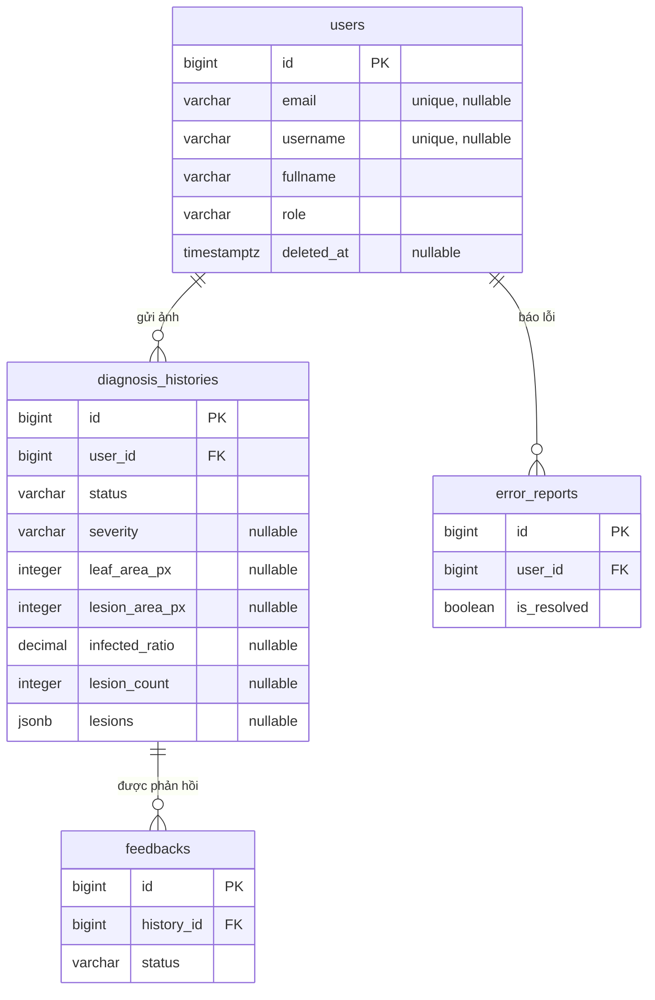

# Cấu trúc Database — Leaf Disease Detection

Tài liệu này mô tả database của backend (Django + PostgreSQL): có những bảng nào, mỗi cột dùng để làm gì, các quy tắc nghiệp vụ mà database đang ép buộc, và những điều cần biết khi viết code đụng tới dữ liệu.

- Schema gốc (xuất từ DrawSQL): [leaf-disease-db.md](leaf-disease-db.md)
- Code model: [backend/api/models.py](../backend/api/models.py)
- Lưu ảnh (tên file, xóa EXIF): [backend/api/images.py](../backend/api/images.py)

> Khi sửa model, hãy cập nhật cả diagram DrawSQL và tài liệu này.

---

## 1. Tổng quan

Chương trình chỉ dùng xử lý ảnh (không dùng học máy) để kết luận lá khỏe hay bệnh. Kết quả của pipeline — diện tích lá, diện tích vết bệnh, tỷ lệ nhiễm, số đốm, chi tiết từng đốm, mức độ — được lưu trong `diagnosis_histories`.

| Bảng | Model Django | Vai trò |
|---|---|---|
| `users` | `User` | Tài khoản người dùng, đăng nhập bằng email |
| `diagnosis_histories` | `DiagnosisHistory` | Mỗi lần người dùng gửi ảnh, kèm kết quả phân tích |
| `feedbacks` | `Feedback` | Người dùng báo một kết quả phân tích bị sai |
| `error_reports` | `ErrorReport` | Báo lỗi ứng dụng do người dùng gửi |



### Quy ước chung

- **Khóa chính** của mọi bảng là `id` (`bigserial`), cấu hình qua `DEFAULT_AUTO_FIELD = BigAutoField`.
- **Khóa ngoại** đặt tên `<bảng số ít>_id` (`user_id`, `history_id`). Trong Django truy cập qua field không có `_id`: `history.user`, `feedback.history`.
- **Thời gian**: cả 4 bảng đều có `created_at` và `updated_at` kiểu `timestamptz`, lưu giờ UTC (`USE_TZ = True`). Cả hai do Django tự điền, kế thừa từ `TimeStampedModel`; không gán tay.
- **Trạng thái / vai trò / mức độ** lưu dạng chuỗi (`varchar(20)`) với danh sách giá trị cố định khai báo bằng `TextChoices` trong model, không có bảng tra cứu riêng. Trong code luôn dùng hằng số, ví dụ `DiagnosisHistory.Status.DONE`, không viết chuỗi `'done'` trực tiếp.
- **Ảnh** lưu trên storage (mặc định thư mục `backend/media/`), database chỉ lưu **đường dẫn tương đối** (`varchar(500)`). Lấy URL đầy đủ bằng `history.original_image.url`.

---

## 2. Chi tiết từng bảng

Các cột là NOT NULL trừ khi ghi "có".

### 2.1. `users`

| Cột | Kiểu | Null | Mặc định | Ý nghĩa |
|---|---|---|---|---|
| `id` | bigserial | | | Khóa chính |
| `email` | varchar(255) | có | | Email đăng nhập. Unique, **không phân biệt hoa thường**. NULL chỉ khi tài khoản đã xóa |
| `username` | varchar(50) | có | | Tên hiển thị tùy chọn. Unique, không phân biệt hoa thường |
| `fullname` | varchar(255) | | | Họ tên |
| `password_hash` | varchar(255) | | | Mật khẩu đã băm. Trong Django là field `password`; luôn dùng `user.set_password()`, không gán trực tiếp |
| `role` | varchar(20) | | `user` | Vai trò nghiệp vụ, xem [mục 3](#3-giá-trị-hợp-lệ-choices) |
| `is_active` | boolean | | `true` | `false` = không đăng nhập được (bị khóa hoặc đã xóa) |
| `is_staff` | boolean | | `false` | Được vào trang `/admin/` |
| `is_superuser` | boolean | | `false` | Có mọi quyền trong admin |
| `last_login` | timestamptz | có | | Django tự cập nhật khi đăng nhập |
| `deleted_at` | timestamptz | có | | Thời điểm người dùng xóa tài khoản. NULL = tài khoản còn hoạt động |
| `terms_accepted_at` | timestamptz | | | Thời điểm đồng ý điều khoản sử dụng |
| `terms_version` | varchar(20) | | | Phiên bản điều khoản đã đồng ý (lấy từ `settings.TERMS_VERSION`) |
| `created_at`, `updated_at` | timestamptz | | | |

**Phân biệt `role` và `is_staff`/`is_superuser`:**
- `role` dùng cho **nghiệp vụ trong app** (ví dụ chỉ `expert` mới được duyệt feedback).
- `is_staff` / `is_superuser` chỉ dùng cho **quyền vào trang admin Django**.
- Không có `role = 'admin'` — quản trị viên là người có `is_staff = true`.

Ngoài ra Django tự tạo 2 bảng phụ `users_groups` và `users_user_permissions` (từ `PermissionsMixin`) để phân quyền trong admin.

### 2.2. `diagnosis_histories`

| Cột | Kiểu | Null | Mặc định | Ý nghĩa |
|---|---|---|---|---|
| `id` | bigserial | | | Khóa chính |
| `user_id` | bigint FK → `users` | | | Người gửi ảnh |
| `original_image` | varchar(500) | | | Ảnh gốc người dùng tải lên (`media/uploads/`) |
| `processed_image` | varchar(500) | có | | Ảnh gốc đã khoanh vùng (bounding box) các vết bệnh (`media/results/`) |
| `status` | varchar(20) | | `pending` | Trạng thái xử lý, xem [mục 4.2](#42-luồng-chẩn-đoán) |
| `error_message` | text | có | | Lý do lỗi khi `status = 'failed'` |
| `severity` | varchar(20) | có | | **Kết luận**: `healthy` = lá khỏe; `mild` / `moderate` / `severe` = lá bệnh ở mức nhẹ / trung bình / nặng |
| `leaf_area_px` | integer | có | | Diện tích lá (số điểm ảnh trên mask lá) — kết quả bước tách nền |
| `lesion_area_px` | integer | có | | Diện tích vết bệnh (số điểm ảnh trên mask vết bệnh) |
| `infected_ratio` | decimal(5,4) | có | | `lesion_area_px / leaf_area_px`, **từ 0 đến 1** (ví dụ `0.0850`). Hiển thị % thì nhân 100 ở frontend |
| `lesion_count` | integer | có | | Số đốm bệnh tìm được bằng contours |
| `lesions` | jsonb | có | | Chi tiết từng đốm, xem bên dưới |
| `is_bookmarked` | boolean | | `false` | Người dùng đánh dấu lưu lại |
| `created_at`, `updated_at` | timestamptz | | | |

Các cột kết quả (`severity` → `lesions`) là NULL khi chưa có kết quả (`pending`, `processing`, `failed`).

`lesions` là danh sách, mỗi phần tử là một đốm bệnh với các thông số lấy từ contour:

```json
[{"area": 412, "perimeter": 88.6, "circularity": 0.66, "center": [215, 140], "bbox": [198, 122, 35, 37]}]
```

| Khóa | Ý nghĩa |
|---|---|
| `area` | Diện tích đốm (điểm ảnh) |
| `perimeter` | Chu vi (`cv2.arcLength`) |
| `circularity` | Độ tròn = 4π·diện tích / chu vi² (1 = tròn hoàn hảo) |
| `center` | Tâm `[x, y]`, tính từ `cv2.moments` |
| `bbox` | Bounding box `[x, y, rộng, cao]` |

Số phần tử của `lesions` phải bằng `lesion_count` (code pipeline đảm bảo, database không kiểm tra).

Những thứ **không** lưu trong database:
- **Ảnh các bước trung gian** (HSV, mask lá, mask bệnh…): pipeline cho cùng kết quả mỗi lần chạy, nên màn demo tính lại khi cần.
- **Ngưỡng phân mức độ** (tỷ lệ bao nhiêu là nhẹ / trung bình / nặng): để trong code pipeline, vì sẽ còn hiệu chỉnh.

### 2.3. `feedbacks`

| Cột | Kiểu | Null | Mặc định | Ý nghĩa |
|---|---|---|---|---|
| `id` | bigserial | | | Khóa chính |
| `history_id` | bigint FK → `diagnosis_histories` | | | Kết quả phân tích bị báo sai |
| `title` | varchar(255) | | | Tiêu đề |
| `description` | text | | | Mô tả sai ở đâu (ví dụ "lá khỏe nhưng bị kết luận bệnh nặng") |
| `status` | varchar(20) | | `pending` | Trạng thái duyệt |
| `created_at`, `updated_at` | timestamptz | | | |

### 2.4. `error_reports`

| Cột | Kiểu | Null | Mặc định | Ý nghĩa |
|---|---|---|---|---|
| `id` | bigserial | | | Khóa chính |
| `user_id` | bigint FK → `users` | | | Người báo lỗi |
| `title` | varchar(255) | | | Tiêu đề |
| `description` | text | | | Mô tả lỗi |
| `is_resolved` | boolean | | `false` | Đã xử lý chưa |
| `created_at`, `updated_at` | timestamptz | | | |

---

## 3. Giá trị hợp lệ (choices)

| Cột | Giá trị | Hằng số trong code |
|---|---|---|
| `users.role` | `user`, `expert` | `User.Role.USER`, `User.Role.EXPERT` |
| `diagnosis_histories.status` | `pending`, `processing`, `done`, `failed` | `DiagnosisHistory.Status.*` |
| `diagnosis_histories.severity` | `healthy`, `mild`, `moderate`, `severe` | `DiagnosisHistory.Severity.*` |
| `feedbacks.status` | `pending`, `accepted`, `rejected` | `Feedback.Status.*` |

Nhãn tiếng Việt để hiển thị: `obj.get_status_display()`, `history.get_severity_display()`, `user.get_role_display()`.

---

## 4. Quy tắc nghiệp vụ

### 4.1. Đăng ký và đăng nhập

- Đăng nhập bằng **email + mật khẩu**. Email được chuyển về chữ thường khi tạo user, và tìm kiếm khi đăng nhập không phân biệt hoa thường — `Foo@Gmail.com` và `foo@gmail.com` là một tài khoản.
- Tạo user **bắt buộc** có `terms_accepted_at` (người dùng tích "Tôi đồng ý" ở màn hình đăng ký). Thiếu thì `User.objects.create_user()` báo lỗi:
  ```python
  User.objects.create_user(
      email, password, fullname=fullname, terms_accepted_at=timezone.now(),
  )  # terms_version tự lấy từ settings.TERMS_VERSION
  ```
- Khi đổi nội dung điều khoản, tăng `TERMS_VERSION` trong `.env`. Có thể so `user.terms_version` với phiên bản hiện hành để yêu cầu đồng ý lại.
- Tài khoản tạo bằng `createsuperuser` hoặc từ trang admin được tự điền `terms_accepted_at` / `terms_version`.

### 4.2. Luồng chẩn đoán

```
pending ──► processing ──► done
                     └───► failed  (ghi error_message)
```

1. Người dùng tải ảnh → tạo bản ghi với `status = pending`, chỉ có `original_image`.
2. Pipeline xử lý ảnh nhận việc → `processing`.
3. Thành công → điền `severity`, `leaf_area_px`, `lesion_area_px`, `infected_ratio`, `lesion_count`, `lesions`, `processed_image`, chuyển `done`.
4. Lỗi (ví dụ không tách được lá khỏi nền) → điền `error_message`, chuyển `failed`.

Database **không cho phép** `status = 'done'` khi còn thiếu một trong `severity`, `leaf_area_px`, `lesion_area_px`, `infected_ratio`, `lesion_count` — phải gán kết quả trước hoặc cùng lúc với việc chuyển trạng thái.

### 4.3. Ảnh và quyền riêng tư

- Ảnh tải lên được **đổi tên thành UUID** (ví dụ `uploads/2026/10/3f2a…e9.jpg`): đường dẫn không chứa tên file gốc hay ID người dùng.
- Khi lưu `DiagnosisHistory` với ảnh mới, **metadata EXIF bị xóa** (tọa độ GPS, tên thiết bị…), ảnh được xoay đúng chiều trước khi xóa EXIF.
- Theo điều khoản sử dụng, ảnh được **giữ lại ẩn danh**, kể cả sau khi người dùng xóa tài khoản.

### 4.4. Xóa tài khoản = ẩn danh hóa

Tài khoản **không bao giờ bị xóa khỏi database**. Khi người dùng xóa tài khoản, gọi:

```python
user.anonymize()
```

Hàm này: đặt `email`, `username` = NULL; `fullname` = "Người dùng đã xóa"; mật khẩu không dùng được; `is_active`, `is_staff`, `is_superuser` = false; `deleted_at` = thời điểm hiện tại; gỡ group/quyền.

Kết quả:
- Lịch sử chẩn đoán, feedback, báo lỗi **vẫn còn**, nhưng không còn gắn với thông tin cá nhân.
- Email và username được giải phóng → người đó **đăng ký lại được** bằng chính email cũ (thành tài khoản mới).

Để chặn xóa nhầm, các khóa ngoại tới `users` dùng `on_delete=PROTECT`: gọi `user.delete()` khi user đã có dữ liệu sẽ báo lỗi. Trong admin, nút Delete của người dùng bị ẩn, thay bằng action **"Ẩn danh hóa (xóa tài khoản)"**.

Khi truy vấn người dùng còn hoạt động, lọc `deleted_at__isnull=True` (hoặc `is_active=True`).

### 4.5. Hành vi khi xóa (on_delete)

| Khóa ngoại | Khi xóa bản ghi cha |
|---|---|
| `diagnosis_histories.user_id` | `PROTECT` — chặn |
| `error_reports.user_id` | `PROTECT` — chặn |
| `feedbacks.history_id` | `CASCADE` — xóa lịch sử thì xóa luôn feedback của nó |

---

## 5. Ràng buộc và index

### Ràng buộc trong database

| Tên | Bảng | Nội dung |
|---|---|---|
| `users_active_requires_email` | `users` | Tài khoản chưa xóa (`deleted_at IS NULL`) bắt buộc có email |
| `users_email_ci_unique` | `users` | Unique trên `LOWER(email)` |
| `users_username_ci_unique` | `users` | Unique trên `LOWER(username)` |
| `dh_ratio_between_0_1` | `diagnosis_histories` | `infected_ratio` nằm trong [0, 1] |
| `dh_lesion_within_leaf` | `diagnosis_histories` | `lesion_area_px <= leaf_area_px` |
| `dh_done_requires_result` | `diagnosis_histories` | `status = 'done'` thì phải có `severity`, `leaf_area_px`, `lesion_area_px`, `infected_ratio`, `lesion_count` |
| (tự động) | `diagnosis_histories` | `leaf_area_px`, `lesion_area_px`, `lesion_count` không âm (`PositiveIntegerField`) |

Vi phạm ràng buộc sẽ ném `IntegrityError` — API nên bắt và trả lỗi 400 thay vì 500.

### Index

| Tên | Bảng | Cột | Phục vụ truy vấn |
|---|---|---|---|
| `idx_dh_user_created` | `diagnosis_histories` | `(user_id, created_at)` | Lịch sử của một người, mới nhất trước |
| `idx_dh_user_bookmarked` | `diagnosis_histories` | `(user_id, is_bookmarked)` | Danh sách đã lưu của một người |
| `idx_er_unresolved` | `error_reports` | `created_at` **WHERE** `is_resolved = false` | Danh sách báo lỗi chưa xử lý |
| (tự động) | các bảng | `created_at`, `status`, `severity`, `role`, các khóa ngoại | |

---

## 6. Cài đặt và migration

```bash
cd backend
pip install -r requirements.txt
cp .env.example .env        # điền DB_PASSWORD, DJANGO_SECRET_KEY (cách tạo key ghi trong file)
python manage.py migrate
python manage.py createsuperuser
```

- Sau khi sửa `models.py`: `python manage.py makemigrations api` rồi `python manage.py migrate`, commit kèm file migration.
- Khi `makemigrations` hỏi "Was X renamed to Y?", chỉ trả lời `y` nếu đúng là đổi tên cùng một dữ liệu; cột mới mang ý nghĩa khác thì trả lời `N`.
- Ngoài 4 bảng trên, Django tự tạo các bảng hệ thống (`django_migrations`, `django_session`, `django_admin_log`, `django_content_type`, `auth_group`, `auth_permission`, các bảng `token_blacklist_*`…) — không cần quan tâm khi làm nghiệp vụ.
